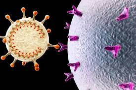
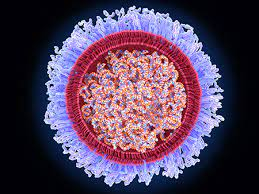
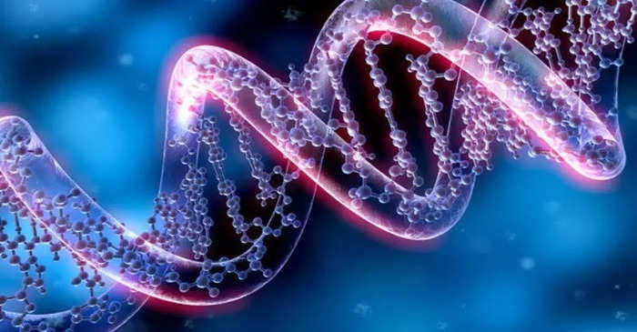
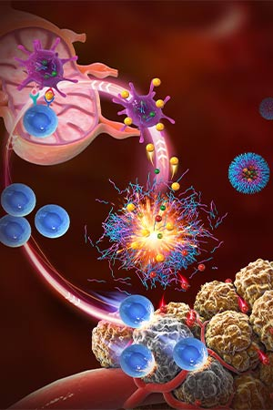
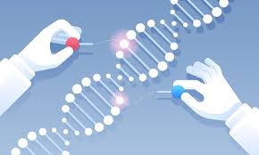

# Mission
 
 

Genome code exist in every living beings. In genome code instructions are written which are translate when certain outcome happen.These insructions are infectious if these instructions are not mutated well, such that CFTR.



In Inital Phase, [Wizdwarfs](https://github.com/ali2210/WizDwarf) mointor your health through genome-code instructions. Calculate predicitive analysis on genes. It will save lot of time and cost. These results are analysis infectious mutation and crossover patterns in your genes.  




In Next phase, our venture interested created in personalized medicines for your body. Some people have certain mutations due to structural & instructional changes in genome. These will cure genetics dieases and neuro-genetics dieases, such that Epilepsy



# Social
[Facebook](https://www.facebook.com/wizdwarfs),
[Instagram](https://www.instagram.com/wisdomenigma), 
[Twitter](https://twitter.com/DwarfWiz),
[Reddit](https://www.reddit.com/r/wizdwarfs),
[Youtube](https://www.youtube.com/channel/UCziNXOl_swLu-SXWWmjFVNA)


```
WisdomEnigma.com 2023
Lahore, Pakistan 
```

