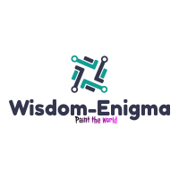

# Pool for Investors

    National Business

        Investors will invest in national brands & icons through Enigma-Assets-Management.
        Return profit on your investment will 10% + taxes appreciation over an year.
        Investors will deposite decent security before investment which will be calculate 
        at time of investment, investment period & location.

        Investors invest as solo (one man), pool(two or more), family (atleast 2) and
        coperate (+500 employees).  

        
    International Business

        Investors will invest in those internnational business which are private and 
        have our legal business team have partner with the state to exercise duty . 
        This investment initate when pool of investors, joint capital assets ($25k).
        Investors will earn good profitability 20% per person of a pool for an year.
        Investors will either deposite security, mortage or capital assets and company
        will owe 50% profit (for coperate) [1000+ employees] while 30% (for 
        non-coperate)[250+ employees]. Business Legal team shared about tax 
        appreciation, capital gain tax [CGT] and capital asset value.

    Software Venture

        This type of investment open for entrepreneurs only. Following requirements are
        1. Entrepreneurs hold public venture with capital asset value $2M.
        2. Entreprenurs must aware of both national or international business & 
        investment rules 
        3. Entreprenurs must follow SEC Laws & Regulations.
        Entreprenurs deposit security either fixed assets or capital assets value. 

# Legal Terms

    In any case, investors will not follow company policies either
         Company issue legal notice of face consequence through legal team,
         Company will owe mortage, capital assets value & fixed assets or
         Company terminate all investment plans after notify.
